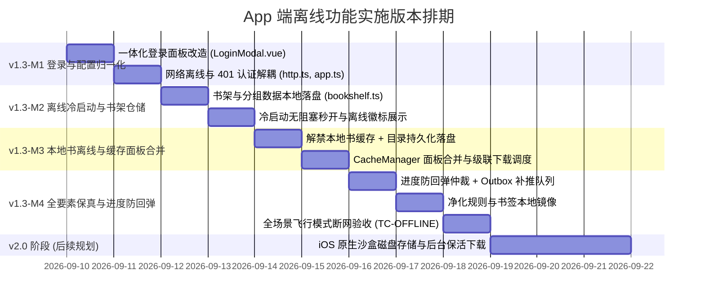

# Reader-Next App 端离线功能增强与体验优化实施方案

> **文档版本**：v1.3（外部评审补全版）  
> **编写日期**：2026-09-09  
> **适用平台**：Reader-Next App（iOS Hybrid WKWebView + Vue 3）  
> **文档状态**：待外部评审（Ready for Review）

---

## 文档修订记录

| 版本 | 修订日期 | 修订内容摘要 | 状态 |
| :---: | :---: | :--- | :---: |
| **v1.0** | 2026-09-09 | 制定初步技术方案，覆盖四大离线诉求（离线启动、书架离线、离线阅读、登录态保持）。 | 已归档 |
| **v1.1** | 2026-09-09 | 补充已有服务端与浏览器缓存机制的改造合并方案，增加全要素离线保真分析与登录面板归一化方案。 | 已归档 |
| **v1.2** | 2026-09-09 | **保留全部原有设计内容**，收敛边界聚焦 App 端（不考虑纯 Web/PWA 缓存），全面增补**变更影响分析（四维度）**与**详细实施版本计划（M1~M4）**，形成完整评审方案。 | 已归档 |
| **v1.3** | 2026-09-09 | 针对评审反馈补全设计细节：登录面板 serverUrl 交互时序与 token 安全策略、书架合并细化与并发竞态处理、本地书云端缓存语义与级联下载实现一致性、Outbox 去重/合并/上限/重试策略、目录失效与刷新机制、章节正文与目录一致性、数据迁移与回滚、TTS 听书协同边界、PWA 死代码清理、版本号语义对齐、补全测试用例矩阵。 | **当前评审版** |

---

## 一、 项目背景与业务诉求

### 1.1 系统架构背景
Reader-Next 移动端当前采用 **iOS Hybrid 架构**：
- **原生层（iOS Swift）**：通过 `WKWebView` 加载打包在应用 Bundle 内的静态资源，通过 URL Scheme（`readapp://localhost/index.html`）拦截加载本地资源，并承担锁屏媒体控件、AVAudioPlayer 后台听书保活与网络请求桥接；
- **展示与交互层（Vue 3 + Vite + Pinia）**：承载书架管理、阅读排版（横向分页/上下滚动）、DOM 文本切片构建、样式与配置渲染；
- **服务端（Rust Axum + SQLite）**：提供书籍管理、书源转码、章节内容下发与账号同步服务。

### 1.2 核心业务诉求与目标
用户在移动端阅读场景下对离线可用性有着刚性需求（如飞机、高铁、地下车库、弱网等）。本次升级需要彻底解决以下 **四大基础离线诉求 + 两大体验优化诉求**：

1. **诉求 1：离线能打开 App**  
   应用冷启动秒开，静态资源从 Bundle 极速直出，网络请求转为后台静默校验，绝不卡在骨架屏、全局加载中或未捕获的报错遮罩。
2. **诉求 2：离线能读取到书架**  
   书架列表与分组数据本地落盘，断网时秒级展示本地已有书籍，卡片清晰标记离线章节数。
3. **诉求 3：离线能阅读已经离线到本地的书籍和章节**  
   彻底解决“目录未离线导致断网进不去书籍”的阻断；建立多级正文寻址；提供主动批量离线下载调度能力。
4. **诉求 4：登录状态正常，不跳出登录界面**  
   用户信息与 Token 一同本地持久化；严格解耦“网络离线”与“401 凭证失效”，断网绝不触发重新登录。
5. **诉求 5（现有缓存机制改造与合并）**：  
   打破本地上传书（TXT/EPUB）被硬编码“不需要额外缓存”且禁用客户端缓存的阻断；将割裂的“服务端缓存”与“浏览器缓存”合并为 App 端统一的“离线到本机”。
6. **诉求 6（登录面板归一化）**：  
   废除 `ServerConfigModal` 与 `LoginModal` 两个弹窗来回跳转、互相唤起的割裂体验，统一为自带服务端地址的一体化登录面板。

### 1.3 边界声明
- **本方案设计与实施纯粹聚焦于 App 客户端（iOS Hybrid 环境）**，不考虑纯 Web 浏览器端与 PWA（ServiceWorker）离线机制。
- 所有设计、交互面板与存储优化均以 App 端运行环境为第一优先级，确保代码改动可控且高内聚。

---

## 二、 现状问题深入剖析与技术根因

### 2.1 登录与认证逻辑：网络异常与 401 混淆导致误判未登录
- **代码位置**：[`frontend/src/stores/app.ts:L72-91`](file:///home/roding/projects/reader-next/frontend/src/stores/app.ts#L72-L91)
  ```typescript
  async function fetchUserInfo() {
    try {
      const data = await getUserInfo()
      ...
      isLoggedIn.value = !!data.userInfo?.username
    } catch {
      isLoggedIn.value = false // ❌ 离线时网络请求失败，直接把登录态重置为 false！
    }
  }
  ```
- **连锁反应**：
  App 启动时在 `App.vue` 中调用 `fetchUserInfo()`。断网导致接口抛错进入 `catch`，`isLoggedIn` 变为 `false`。
  随后在 [`frontend/src/api/http.ts:L72-74`](file:///home/roding/projects/reader-next/frontend/src/api/http.ts#L72-L74) 中，响应拦截器与错误派发未对网络超时、断网进行隔离，触发全局 `need-login` 事件；`App.vue` 检查到 `!isLoggedIn`，**直接弹出登录窗口阻断用户**。
- **登录弹窗割裂**：
  目前 App 端存在 `ServerConfigModal.vue`（配地址+账号密码）与 `LoginModal.vue`（账号密码+底部修改地址链接），两者互相跳转、调用链路分散。

### 2.2 书架仓储：纯内存管理，断网列表丢失
- **代码位置**：[`frontend/src/stores/bookshelf.ts:L104-120`](file:///home/roding/projects/reader-next/frontend/src/stores/bookshelf.ts#L104-L120)
  ```typescript
  async function fetchBooks() {
    loading.value = true
    try {
      const [serverBooks, browserSummaries] = await Promise.all([
        getBookshelfWithCacheInfo(),
        listBrowserCacheSummary().catch(() => []),
      ])
      books.value = serverBooks.map(...)
    } finally {
      loading.value = false
    }
  }
  ```
- **问题**：`books.value` 仅保存在 Pinia 内存中，从未向 LocalStorage 或本地数据库落盘。只要断网启动，`getBookshelfWithCacheInfo()` 请求失败抛错，书架直接呈现为空数组，用户无法看到已有的书籍卡片。

### 2.3 阅读与缓存链路：目录未落盘、本地书被硬编码禁存、缓存双轨割裂
1. **致命阻断：章节目录（ChapterList）从未做离线持久化**  
   在 [`frontend/src/stores/reader.ts:L1640`](file:///home/roding/projects/reader-next/frontend/src/stores/reader.ts#L1640) 中，进入阅读器必须调 `getChapterList` 拿网络目录。离线时第一步就抛错，连目录都拉不到，后续无论单章缓存是否存在均无法定位。
2. **本地上传书（TXT/EPUB）被禁用客户端缓存（历史设计盲区）**  
   - [`CacheManager.vue:L45-47`](file:///home/roding/projects/reader-next/frontend/src/components/reader/CacheManager.vue#L45-L47) 判定 `isLocalTxt` 时弹窗提示：*“本地书已存放在服务端书架文件中，不需要额外缓存...”*，直接拒绝提供下载选项；
   - [`reader.ts:L1731-1735`](file:///home/roding/projects/reader-next/frontend/src/stores/reader.ts#L1731-L1735) 硬编码 `useBrowserCache = !isLocalTxt`，**彻底禁用了本地书的客户端缓存写入**；
   - 导致断网时手机连不上后端服务器，用户连自己上传的书都无法阅读。
3. **双轨概念割裂**  
   网络书在 `CacheManager.vue` 中分成了“服务端缓存”和“浏览器缓存”两套截面。App 端用户只关心“下载到当前手机”，双轨设计让用户极度困惑，且常误点服务端缓存导致手机无缓存。

### 2.4 阅读进度：离线阅读后联网存在回弹覆盖风险
- **代码位置**：[`frontend/src/stores/reader.ts:L1680-1720`](file:///home/roding/projects/reader-next/frontend/src/stores/reader.ts#L1680-L1720)
  离线时阅读进度仅保存在 `localStorage('reader-currentIndex')`。
  用户断网从第 10 章读到第 30 章，联网后 App 调用 `fetchBooks`，服务器返回的仍是旧的第 10 章；若前端无条件信任服务端数据，用户的阅读进度将被**瞬间倒退覆盖回第 10 章**。

---

## 三、 总体架构设计与核心技术方案

### 3.1 总体架构流程图

```mermaid
flowchart TD
    subgraph 认证与启动层
        A[App 启动] --> B[从 localStorage 还原 accessToken 与 userInfo]
        B --> C[isLoggedIn 立即为 true (无网绝不弹登录)]
        C --> D[启动网络健康校验]
        D --> E{网络状态}
        E -- 断网/超时 --> F[保持登录态，标记离线模式]
        E -- 明确返回 401 --> G[清除凭证，呼出一体化登录面板]
    end

    subgraph 书架与元数据层
        H[fetchBooks] --> I[优先渲染本地持久化的 Bookshelf & Groups]
        I --> J{是否在线?}
        J -- 是 --> K[静默拉取远端更新，合并并刷新本地持久化]
        J -- 否 --> L[保持本地书架展示，显示离线章节徽标]
    end

    subgraph 阅读器寻址引擎
        M[打开书籍] --> N[读取本地持久化 ChapterList 目录]
        N -- 本地有目录 --> O[秒级渲染目录并定位目标章节]
        N -- 本地无目录且离线 --> P[提示: 首次阅读请先联网加载目录]
        O --> Q[章节正文寻址 (三级引擎)]
        Q --> R{寻址优先级}
        R -- 1. L1 内存预载 --> S[秒级渲染正文]
        R -- 2. L2 本地离线库 (IndexedDB) --> S
        R -- 3. L3 远端 API (若在线) --> T[在线获取并写入本地离线库]
        R -- 离线且未下载 --> U[友好提示: 当前章节未离线下载]
    end

    subgraph 进度防回弹与仲裁
        V[阅读翻页/切章] --> W[更新本地进度与时间戳 durChapterTime]
        W --> X{当前是否在线?}
        X -- 是 --> Y[同步上报服务端]
        X -- 否 --> Z[压入本地待同步 Outbox 队列]
        Z --> AA[网络恢复瞬间自动批量补推]
    end
```

---

### 3.2 离线优先认证与面板归一化方案

#### 1. 认证凭据双持久化与网络解耦
- **凭证存储**：登录成功后，不仅保存 `accessToken`，同时将 `userInfo`（用户名、昵称、角色）序列化存入 `localStorage('reader-user-info')`；
- **初始化时序**：App 启动初始化时，只要本地存在 `accessToken` 与 `userInfo`，直接设定 `isLoggedIn = true`，**绝不等待网络请求返回**；
- **网络错误隔离**：
  - 在 [`app.ts`](file:///home/roding/projects/reader-next/frontend/src/stores/app.ts) 的 `fetchUserInfo()` 中，捕获异常后若已有本地登录态，**严禁将 `isLoggedIn` 设为 `false`**；
  - 在 [`http.ts`](file:///home/roding/projects/reader-next/frontend/src/api/http.ts) 响应拦截器中，仅在 `error.response?.status === 401` 或响应明确包含 `NEED_LOGIN` 时触发 `need-login`；网络断开（`ERR_NETWORK`、超时、无响应）一律视为常规网络错误抛出，绝不分发重新登录事件。

#### 2. App 端登录面板合二为一（归一化）
- **废弃 `ServerConfigModal.vue`**：将功能完全收敛进 [`LoginModal.vue`](file:///home/roding/projects/reader-next/frontend/src/components/LoginModal.vue)，并物理删除该组件文件；同时从 [`app.ts`](file:///home/roding/projects/reader-next/frontend/src/stores/app.ts) 的 store return 中移除 `showServerConfigModal` ref，从 [`SettingsDrawer.vue`](file:///home/roding/projects/reader-next/frontend/src/components/SettingsDrawer.vue) 中删除对 `showServerConfigModal` 的引用，确保废弃不留死代码；
- **一体化交互形态**：
  - 在 App 环境（`isNativeApp() === true`）：
    - 顶部直接常驻展示 **【服务器地址】** 输入框，自动回显当前 `localStorage.getItem('server_base_url')`，用户随时可见、随时可改；
    - 下方直接衔接 **【用户名】**、**【密码】** 及 **【登录/注册切换】**；
    - 用户点击“登录”或“连接并登录”，一次性保存最新地址并完成鉴权；
    - 彻底删除原有底部的“修改服务器地址”跳转链接；
  - 在 Web 浏览器端（`!isNativeApp()`）：
    - 自动隐藏“服务器地址”输入框（默认走同源 `/reader3`），不打扰网页版用户。
- **serverUrl 输入交互与校验时序**：
  - **回显时机**：弹窗 `v-model` 由 `false → true` 切换时（通过 `watch(() => props.modelValue)`），从 `localStorage.getItem('server_base_url')` 重新读取回显，避免上一次未保存的草稿污染本次输入；
  - **格式校验**：提交前做轻量校验，必须以 `http://` 或 `https://` 开头、不能以 `/` 结尾；不通过则在输入框下方给出红字提示“请输入完整的服务器地址（例如 http://192.168.1.10:18080）”，不发起网络请求；
  - **写入时序**：`handleSubmit` 内按以下顺序原子化执行，任何一步失败均不破坏现有登录态：
    1. `const trimmedUrl = form.serverUrl.trim().replace(/\/+$/, '')`；
    2. `localStorage.setItem('server_base_url', trimmedUrl)`；
    3. `http.defaults.baseURL = trimmedUrl`；
    4. `await login(...)` / `await register(...)`；
    5. 成功 → `appStore.setUser(user)` + `close()` + `shelfStore.fetchBooks()`；失败 → 保留上述已写入的 baseURL（便于用户看到真实错误），但不清空 `accessToken`；
  - **关闭即放弃**：用户修改 serverUrl 但未点击登录直接关闭弹窗，**不回写** `localStorage` 与 `http.defaults.baseURL`，避免误改地址导致后续请求 404；
  - **无 token 优先**：App 首次启动时，若 `localStorage` 中无 `server_base_url` 且无 `accessToken`，直接弹出 LoginModal（而非先调 `fetchUserInfo` 触发无谓的网络错误），与 [`App.vue` 的 `onMounted`](file:///home/roding/projects/reader-next/frontend/src/App.vue) 分支保持一致。

#### 3. 凭证持久化安全策略（新增）
- **现状风险**：直接将 `accessToken` 明文存入 `localStorage`，在 iOS Hybrid 环境下 WebView 的 localStorage 与 Safari 私密浏览类似，会被系统隔离但**不加密**；App 卸载/重装或设备越狱场景下存在凭证泄漏风险。
- **v1.3-M1 阶段**（最小代价）：保持 `localStorage` 存储但增加以下兜底：
  - 在 [`app.ts`](file:///home/roding/projects/reader-next/frontend/src/stores/app.ts) 的 `clearUser()` 中**一并**清理 `accessToken` 与 `reader_user_info_cache`，防止残留；
  - 服务端 401 时立即调用 `clearUser()`，避免过期 token 仍可被用于其他请求；
  - `userInfo` 缓存中**不写入** `accessToken`、`refreshToken` 等敏感字段，仅存 `username`/`nickname`/`isAdmin` 等纯展示字段；
- **v2.0 阶段（后续规划）**：通过 `nativeBridge` 桥接到 iOS `Keychain` 存储 `accessToken`，前端只持有内存引用，彻底脱离 localStorage 明文；
- **登录态初始化时序**（与上文"初始化时序"对接）：
  - 启动时先读 `localStorage.accessToken` 决定 `isLoggedIn` 初值（**不**等待网络返回）；
  - `fetchUserInfo()` 在后台异步校验：成功刷新本地缓存的 `userInfo`；失败若为 401/`NEED_LOGIN` → `clearUser()` + 弹登录面板；失败为网络错误 → **保留登录态**，标记 `isOnline=false`。

---

### 3.3 离线冷启动与书架仓储落盘方案

#### 1. 本地书架持久化（Stale-While-Revalidate）
- 在 [`bookshelf.ts`](file:///home/roding/projects/reader-next/frontend/src/stores/bookshelf.ts) 建立 `reader_bookshelf_cache` 与 `reader_book_groups_cache`；
- 启动读取流水线：
  ```typescript
  async function fetchBooks() {
    // 1. 优先读取本地持久化，实现 0ms 秒开书架
    if (books.value.length === 0) {
      books.value = loadLocalCachedBookshelf()
      groups.value = loadLocalCachedGroups()
      await refreshRecentBooks()
    }
    
    // 2. 尝试后台静默拉取远端更新
    try {
      const [serverBooks, serverGroups, browserSummaries] = await Promise.all([
        getBookshelfWithCacheInfo(),
        getBookGroups().catch(() => []),
        listBrowserCacheSummary().catch(() => []),
      ])
      // 合并进度（带防回弹仲裁）并刷新本地持久化
      ...
      saveLocalCachedBookshelf(books.value)
    } catch (err) {
      console.warn('远端书架同步失败，继续使用本地离线书架', err)
    }
  }
  ```

#### 2. 书架角标离线感知
- 书架书籍卡片结合本地已缓存章节计数（`browserCachedChapterCount`），清晰呈现“已离线 120/120 章”或“离线 50 章”的徽标。

#### 3. 书架合并细化规则（新增）
本地 `books.value` 与服务端 `serverBooks` 的合并须遵循以下明确规则，避免合并后出现进度回退、缓存计数丢失或卡片闪烁：

- **主键对齐**：以 `bookUrl` 为主键合并，构建 `localMap: Map<bookUrl, Book>` 与 `serverMap: Map<bookUrl, Book>`；
- **字段优先级**（按字段逐项仲裁，不整本覆盖）：
  - `durChapterIndex` / `durChapterPos` / `durChapterTime`：以**进度仲裁规则**（见 3.5.2）为准 —— 取 `max(local.durChapterTime, server.durChapterTime)` 对应的一方；若任一方无 `durChapterTime`，则取 `max(local.durChapterIndex, server.durChapterIndex)`；
  - `cachedChapterCount`（服务端缓存数）：**取 serverBooks 值**，本地无该字段权威性；
  - `browserCachedChapterCount`（本机离线数）：**取本地 `browserMap.get(bookUrl)` 值**，远端无法感知本机 IndexedDB；
  - `name` / `author` / `coverUrl` / `latestChapterTitle` / `totalChapterNum` 等元数据：**取 serverBooks 值**（远端为权威）；
  - `recentReadAt` / `localBookPath` 等纯本地字段：**保留本地值**不被覆盖；
- **删除感知**：服务端返回中**不**存在的 `bookUrl`，若本地仍有 → 在远端确认成功时从本地缓存删除（用户在另一台设备删书的同步语义）；远端请求失败时**不删除**任何本地条目（避免离线误删）；
- **新增感知**：服务端返回中有、本地无的 `bookUrl` → 直接加入；
- **顺序**：合并后**保持服务端顺序**（用户可能在另一台设备调整过排序），本地独有的条目追加在末尾；
- **写回**：合并完成后立即 `localStorage.setItem(BOOKSHELF_CACHE_KEY, JSON.stringify(books.value))`，保证下次冷启动可直接复用。

#### 4. fetchBooks 并发竞态与版本号机制（新增）
- **竞态场景**：用户冷启动看到本地书架后立即点书卡进入阅读器（路由切换 + `loadBook` 启动），同时后台 `fetchBooks` 的远端段异步返回并 `books.value = mergeBooksWithLocalProtection(...)` 替换整个数组 → 用户正在阅读的书籍上下文可能被替换、卡片闪烁；
- **解决方案：单次 fetchBooks 版本号 + 取消信号**：
  ```typescript
  let fetchBooksSeq = 0
  async function fetchBooks() {
    const mySeq = ++fetchBooksSeq
    // 1. 本地秒出（无远端依赖）
    if (books.value.length === 0) {
      books.value = loadCachedBookshelf()
      groups.value = loadCachedGroups()
    }
    // 2. 远端静默拉取
    try {
      const [serverBooks, ...] = await Promise.all([...])
      if (mySeq !== fetchBooksSeq) return // 已被更新的 fetchBooks 覆盖，放弃本次写入
      books.value = mergeBooksWithLocalProtection(...)
      saveLocalCachedBookshelf(books.value)
    } catch (err) {
      // 远端失败保留本地，不闪烁
    }
  }
  ```
- **用户操作保护**：进入阅读器（`route.name === 'reader'`）期间，`fetchBooks` 的远端段**只更新 books 数组本身**，不替换 `recentBooks.value`；若用户正在阅读的 `bookUrl` 在合并后消失（远端确认被删），通过 `useReaderStore.book` 内的本地引用保持阅读上下文不丢失，仅在用户主动退出阅读器时提示"此书已不在书架"。

#### 5. 离线书架空数据兜底
- 首次启动（本地无 `reader_bookshelf_cache`）+ 断网 → `books.value` 为空数组，此时书架页面渲染空状态卡片："**尚未加载任何书籍，请联网后添加**"，绝不展示骨架屏无限转圈或抛错遮罩；
- 离线时 `loading.value` **必须**先置 `false` 再渲染空状态，避免用户误以为加载中。

---

### 3.4 缓存机制改造与合并方案（统一为“下载到本机”）

#### 1. 解除本地上传书（TXT/EPUB）禁用缓存限制
- 在 [`reader.ts:L1732`](file:///home/roding/projects/reader-next/frontend/src/stores/reader.ts#L1732) 中，**彻底删除 `useBrowserCache = !isLocalTxt`**，统一对所有书籍开放客户端离线写入与读取；
- [`CacheManager.vue`](file:///home/roding/projects/reader-next/frontend/src/components/reader/CacheManager.vue) 移除“本地书不需要额外缓存”的阻断提示，提供一键全本离线到手机能力。

#### 2. 双轨交互收敛为统一面板
- 面板不再区分“服务端”与“浏览器”，统一收敛为：
  - `下载后续 50 章`
  - `下载后续 100 章`
  - `全本离线下载`
  - `清除本机离线数据`
- 统计指标统一展示：大字展示 **“本机已离线：X 章”**，辅助展示“云端已就绪：Y 章”。

#### 3. 云端与本机级联下载调度
- 点击下载时，前端发起批量章节请求：
  - 若服务端已缓存，服务端秒级下发，手机端高速写入本地；
  - 若服务端未缓存，服务端后台抓取的同时流式回传手机写入本地；
  - **用户只需一次点击，同时完成云端加速与手机本机落盘**。

#### 4. 级联下载实现一致性约束（新增）
- **现状偏离**：当前 [`CacheManager.vue`](file:///home/roding/projects/reader-next/frontend/src/components/reader/CacheManager.vue) 的"下载到本机"与"云端预缓存"是两套独立 section、两套独立按钮，无任何级联调用，与上文 3.4.3 节"一次点击同时完成云端加速与本机落盘"的目标偏离；
- **v1.3-M3 实施约束**：
  - **主面板**只保留一套"下载到本机（50/100/全本）"按钮，点击后内部自动完成"云端预缓存 → 本机落盘"级联，不再暴露独立的云端缓存入口；
  - 级联实现采用"服务端 SSE 优先 + IndexedDB 兜底"：先调 `cacheBookSSE` 启动服务端流式抓取并回传，每收到一章即写入 IndexedDB；若 SSE 中断或服务端无该能力，自动降级为前端串行 `getBookContent` 拉取并写入 IndexedDB；
  - **进度统一**：`progress.value` / `currentStatus` 只反映**本机已落盘章节数**，云端缓存章节数作为副指标"云端就绪：Y 章"显示在摘要卡，避免用户混淆；
  - **失败重试**：单章失败不阻塞整体，记录在 `failedChapters: Set<number>`，整体完成后向用户提示"X 章下载失败，可重试"，提供"重试失败章节"按钮；
- **可选保留**：高级用户场景下保留一个折叠展开的"仅云端预缓存（不落盘本机）"次级面板，默认折叠，避免普通用户误点。

#### 5. 本地书（isLocalTxt）的"云端缓存"语义（新增）
- **现状问题**：当前 [`BookCard.vue:163`](file:///home/roding/projects/reader-next/frontend/src/components/BookCard.vue#L163) 与 [`CacheLibraryModal.vue`](file:///home/roding/projects/reader-next/frontend/src/components/CacheLibraryModal.vue) 把 `totalChapterNum` 当作本地书的"云端就绪数"显示，语义错乱 —— 本地书的章节本就存放在服务端书架文件中，无独立"云端缓存"概念；
- **统一语义**：
  - 本地书的卡片摘要只显示"**本机已离线 X / 共 Y 章**"，不显示"云端就绪"；
  - [`CacheManager.vue`](file:///home/roding/projects/reader-next/frontend/src/components/reader/CacheManager.vue) 在 `isLocalTxt` 时**完全隐藏**"云端预缓存（服务端）"section（`v-if="!isLocalTxt"` 已存在，但需进一步收紧 BookCard/CacheLibraryModal 的摘要展示）；
  - `serverCachedCount` computed 在 `isLocalTxt` 时返回 `0` 而非 `totalChapterNum`，避免给用户造成"云端已就绪全本"的错觉；
- **理由**：本地书断网时无法连服务端取上传文件，唯一可靠路径就是本机离线，"云端就绪"对本地书无意义。

#### 6. Native 与 IndexedDB 双写策略（新增）
- **现状**：[`browserCache.ts`](file:///home/roding/projects/reader-next/frontend/src/utils/browserCache.ts) 的 `setBrowserCachedChapter` 在 `isNativeApp()` 时改为"Native 与 IndexedDB 双写"（`void invokeData('saveCache', params).catch(...)` 不提前 return，继续走 IndexedDB 写入）；
- **一致性约束**：
  - **IndexedDB 为权威兜底**：所有读取路径（`getBrowserCachedChapter` / `listBrowserCacheSummary` / `countBrowserBookCache`）一律从 IndexedDB 读取，Native 端缓存仅作为 Native 侧（如 TTS 音频缓存）的快速通道；
  - **Native 写入失败容忍**：`invokeData('saveCache')` 失败时只打印日志，不阻塞 IndexedDB 写入；
  - **清理路径统一**：`deleteBrowserBookCache` 同时清理 IndexedDB（chapters 表 + chapter_lists 表）并调用 Native `clearCache`（如已实现）；
  - **冲突处理**：若 Native 与 IndexedDB 数据不一致，以 IndexedDB 为准重建 Native 缓存（v2.0 阶段实现，v1.3 阶段双写即可）。

---

### 3.5 全要素离线阅读保真与进度防回弹方案

#### 1. 章节目录（ChapterList）离线持久化
- 在 [`browserCache.ts`](file:///home/roding/projects/reader-next/frontend/src/utils/browserCache.ts) 中升级 IndexedDB，新增 `chapter_lists` 表；
- 首次在线加载目录成功后自动落盘，并在离线进入书籍时作为主力数据源，**彻底打通离线打开书籍与选章阅读的阻断**。

#### 1a. 目录失效与刷新策略（新增）
- **失效信号**：
  - 服务端目录返回的 `totalChapterNum` > 本地缓存的 `totalChapterNum` → 视为有新增章节，本地目录失效；
  - 用户主动点击阅读器"刷新目录" → 强制失效；
  - TTL 兜底：本地 `chapter_lists` 记录的 `updatedAt` 距今 > 7 天，再次进入书籍时**先尝试远端拉取**，远端失败再回退本地；
- **刷新流程**：
  ```text
  进入书籍 loadBook(book)
  ├─ 读本地 chapter_lists[bookUrl]
  ├─ 同时尝试 getChapterList(远端)
  ├─ 远端成功且 totalChapterNum >= 本地 → 覆盖本地 + 写回 IndexedDB
  ├─ 远端成功但 totalChapterNum < 本地（异常）→ 不覆盖，仅告警，沿用本地
  ├─ 远端失败但有本地 → 沿用本地 + Toast"已切换离线目录"
  └─ 远端失败且无本地 → 抛错 + 提示"首次阅读请联网加载目录"
  ```
- **孤儿章节正文清理**：若远端目录刷新后 `chapter.url` 变化（书源切换或目录重排），本地 `chapters` 表中以旧 `chapter.url` 为键的正文记录会成孤儿。提供 `cleanupOrphanChapters(bookUrl, validChapterUrls: Set<string>)` 工具函数，在 `setBrowserCachedChapterList` 写入新目录后**异步调用**，删除该 bookUrl 下不在 `validChapterUrls` 集合中的所有正文记录；

#### 2. 阅读记录防回弹仲裁与离线出箱（Outbox）
- **仲裁规则**：
  在同步书架与更新书籍进度时，比较 `local.durChapterTime` 与 `server.durChapterTime`（以及 `durChapterIndex`）。
  只要本地时间戳更新或阅读章节更深，**坚决保留本地最新进度**，杜绝被服务端旧进度覆盖倒退。
- **仲裁键统一（关键修订）**：
  - **问题**：当前 `setActiveChapterState` 中 `book.value.durChapterTime = Date.now()` 使用客户端本地时间，而服务端 `durChapterTime` 为服务端时间，两者基准不一致，跨设备/长时间断网后直接比较不可靠；
  - **统一基准**：仲裁改为**二维键比较**，时间戳仅作辅助：
    1. **主键**：`durChapterIndex` 较大者胜出（更深章节视为更新进度）；
    2. **次键**：`index` 相同时比较 `durChapterPos`（章节内阅读位置）较大者；
    3. **辅助键**：前两者都相同时比较 `durChapterTime`，但需在客户端写入时统一为 `Date.now()`，在收到服务端进度时**用本地 `Date.now()` 重新打时间戳**（即"接收时间"），避免跨设备时钟漂移；
  - 这样仲裁只依赖**单调序号**（章节索引 + 章节内位置），时间戳作为兜底，可靠性大幅提升。
- **离线 Outbox 队列**：
  断网时未发送成功的 `saveBookProgress` 请求存入 `offline_progress_outbox` 本地队列；
  监听 `window.addEventListener('online')`，网络连通瞬间自动将队列内容批量回传服务端。

#### 2a. Outbox 去重 / 合并 / 上限 / 重试策略（新增）
- **数据结构**：
  ```typescript
  interface ProgressOutboxEntry {
    bookUrl: string
    index: number
    position: number
    ts: number            // 入队时间（Date.now()）
    retryCount: number   // 已重试次数
  }
  ```
  存储于 `localStorage['reader_progress_outbox']`，序列化为 JSON 数组；
- **去重 / 合并**：
  - **同一 bookUrl** 多次入队 → **合并为最新一条**（保留最新 `index` / `position` / `ts`），丢弃旧的；
  - 队列内 `bookUrl` 唯一，避免同一本书堆积大量中间进度；
  - 合并发生在 `queueProgressToOutbox()` 内部：先 `entries.filter(e => e.bookUrl !== newEntry.bookUrl)`，再 push 新条目；
- **上限保护**：
  - 队列长度上限 **200 条**（实际由于按 bookUrl 合并，正常使用不会接近）；
  - 超出上限时丢弃**最旧**的条目（按 `ts` 升序丢弃），并打印警告；
- **重试策略**：
  - `online` 事件触发后调用 `flushProgressOutbox()`，**串行**推送（避免并发打爆服务端）；
  - 单条推送失败：
    - 网络错误（`ERR_NETWORK` / 超时）→ `retryCount++`，保留在队列，下次 `online` 或下次 `fetchBooks` 成功时再试；
    - 服务端返回 4xx（如 400 参数错误 / 403 越权）→ 视为不可恢复，从队列**删除**该条目并 Toast 提示"进度同步异常，已跳过"；
    - 服务端返回 5xx → `retryCount++`，保留重试；
  - **重试上限**：单条 `retryCount >= 5` 时从队列删除，避免无限重试堆积；
  - **服务端压力保护**：批量推送时每条间隔 200ms，单批最多 20 条，超出部分等下一次 `online` 或定时器（每 5 分钟检查一次队列）；
- **去重写入时机**：
  - `flushProgressToServerKeepalive` 内 `fetch(...).catch(() => queueProgressToOutbox(...))` —— 仅在 fetch 真失败时入队，不重复入队；
  - `persistProgress` 失败 → 入队；
  - App 退出 / 页面隐藏（`visibilitychange` → `hidden`）→ 强制 flush 一次，失败入队；
- **冲突处理**：服务端收到旧进度（如设备 A 离线期间设备 B 已读到第 50 章，设备 A 联网推送第 30 章）→ 由服务端按"二维键仲裁"自行判断是否接受，客户端不主动判断；客户端 Outbox 推送后**总是重新拉取** `getShelfBook(bookUrl)` 与本地进度再次仲裁，确保 UI 反映服务端最新值。

#### 3. 阅读设置、净化规则与书签保真
- **阅读设置 100% 离线可用**：
  字体大小、行距、页边距、背景主题色、翻页模式（横向分页/上下滚动）均已保存在 `localStorage('readConfig')` 中。字体使用系统内置字体族（`system`、`heiti`、`kaiti`、`songti`），无任何外部网络字体依赖，断网下排版与视觉与在线 100% 一致。
- **净化替换规则离线化**：
  `fetchReplaceRules` 成功后存入 `localStorage('reader_replace_rules')`，离线阅读时继续执行文本净化清洗，排版不出现多余乱码。
- **书签本地镜像**：
  增设 `reader_bookmarks_${bookUrl}` 本地镜像，离线时点击“添加当前页书签”即时在本地目录中生效展示，联网后静默同步后端。

#### 3a. 章节正文缓存与目录更新的一致性（新增）
- **问题**：`setBrowserCachedChapterList` 写入新目录后，若新目录中 `chapter.url` 与旧目录不同（书源切换、目录重排），IndexedDB `chapters` 表中以旧 `chapter.url` 为键的正文记录会成孤儿，占空间且可能在 `listBrowserCacheSummary` 中误统计为"已离线"；
- **一致性约束**：
  - `setBrowserCachedChapterList(bookUrl, chapters)` 内部在写入新目录后，**异步调用** `cleanupOrphanChapters(bookUrl, new Set(chapters.map(c => c.url)))`；
  - `cleanupOrphanChapters` 实现：打开 `chapters` 表，按 `bookUrl` 索引取所有记录，过滤出 `chapterUrl` 不在 validUrls 中的，逐条删除；
  - `countBrowserBookCache` / `listBrowserCacheSummary` 的统计基于 `chapters` 表实际记录数，孤儿清理后统计自动准确；
  - 删除操作不阻塞 UI，失败只打日志（最坏情况是空间占用略多）；
- **本地书（isLocalTxt）特殊处理**：本地书的 `chapter.url` 形如 `local-txt:abc#0`，章节正文直接来自服务端书架文件，**不写入** IndexedDB（避免与目录正文重复存储）；缓存面板对本地书仍提供"离线到本机"按钮，但实际行为是触发服务端把上传文件解析后流式回传并写入 IndexedDB。

---

## 四、 变更影响分析（Impact Analysis / Blast Radius）

### 4.1 对纯 Web 浏览器端的影响
- **影响范围**：极低（零破坏性）。
- **具体表现**：
  - 登录面板通过 `isNativeApp()` 运行时判定，非 App 环境自动隐藏“服务器地址”框，Web 用户完全无感知；
  - 解除 `isLocalTxt` 限制对 Web 浏览器用户同样带来弱网离线增益；
  - 纯 Web 浏览器端原有功能、书源管理、设置抽屉逻辑完全向后兼容。

### 4.2 对 iOS App 客户端体验的影响
- **影响范围**：核心主链路，体验显著正向提升。
- **具体表现**：
  - 消除冷启动对网络的强依赖，解决白屏与误跳登录；
  - 登录面板统一，用户随时可见、随时可改当前服务器地址，消除配置困惑；
  - 彻底跑通“断网开 App $\rightarrow$ 进书架 $\rightarrow$ 开书籍目录 $\rightarrow$ 读已缓存正文 $\rightarrow$ 进度防回弹”的完整闭环。

### 4.3 对后端 Rust 服务端的影响
- **影响范围**：零影响（Zero Breaking Changes）。
- **具体表现**：
  - 现有的 `/saveBookProgress`、`/getBookContent`、`/getBookshelfWithCacheInfo`、`/getChapterList` 接口签名与数据结构保持 100% 不变；
  - 客户端离线期间产生的进度出箱（Outbox）在联网后以常规请求发送，服务端无须感知客户端是否经历过离线，无须执行任何数据库结构变更或服务端升级。

### 4.4 对 TTS 听书系统的影响
- **影响范围**：高度协同与正面促进。
- **具体表现**：
  - 听书系统（v1.0~v1.2 已落地）与正文排版共用 `originalIndex` 锚点体系；
  - 本方案完成正文与目录离线落盘后，为后续规划的 **v2.0 听书沙盒音频磁盘缓存（F-E1~E4）** 与 `originalIndex` 进度键改造（F-C4）提供了坚实的正文数据底座，两者无缝衔接。

### 4.5 风险点评估与容错兜底（Failure Modes & Fallback）
1. **本地存储数据损坏容错**：
   所有新增的 `localStorage` 与 `IndexedDB` 读写均采用严格的 `try-catch` 包裹，若本地数据损坏或反序列化失败，自动回退到安全的空结构并打印警告日志，坚决避免页面白屏。
2. **存储空间配额保护**：
   纯文本小说体积极小（1 万章 TXT 正文通常 $< 50\text{MB}$），对手机沙盒空间压力极低；同时面板提供“清除本机离线数据”功能，用户可随时释放空间。
3. **凭证安全风险（新增）**：
   - `accessToken` 明文存于 `localStorage`，在 iOS Hybrid 环境下虽被系统隔离但不加密，存在 App 卸载/重装、设备越狱场景下的凭证泄漏风险；
   - v1.3-M1 阶段通过 `clearUser()` 一并清理 `accessToken` + `reader_user_info_cache`、`userInfo` 缓存不写敏感字段等措施降低风险；
   - v2.0 阶段桥接 iOS `Keychain` 彻底解决（见 3.2.3 节）。
4. **Outbox 批量推送对服务端的瞬时压力（新增）**：
   - 长时间断网 + 用户在多本书上翻页 → Outbox 积累条目；网络恢复瞬间若并发推送可能瞬时打爆服务端 `/saveBookProgress`；
   - 已约束：按 bookUrl 合并（同书只保留最新一条）、串行推送、单批最多 20 条、每条间隔 200ms、单条 `retryCount >= 5` 丢弃；
   - 服务端响应慢或 5xx 时自动停止本次 flush，等下一次 `online` 或 5 分钟定时器再试。
5. **iOS WebView IndexedDB 在低内存下被系统回收（新增）**：
   - iOS WKWebView 在内存告急时可能回收非持久化的 IndexedDB 数据；本方案在 [`browserCache.ts`](file:///home/roding/projects/reader-next/frontend/src/utils/browserCache.ts) 中已通过 `dbPromise` 单例 + 标准的 `onupgradeneeded` 流程确保数据库在回收后能自动重建；
   - 但用户已离线的章节正文可能丢失，需通过 Native 双写（见 3.4.6 节）兜底，重要数据由 Native 沙盒持有；
   - 风险提示：极端低内存场景下离线阅读可能降级为"已 Native 缓存的章节可读、IndexedDB 中的不可读"，用户体感仍可阅读最新几章（Native 端 TTS 预缓存兜底）。
6. **跨设备进度冲突（新增）**：
   - 用户在设备 A 离线读到第 30 章，期间设备 B 在线读到第 50 章，设备 A 联网推送第 30 章 → 服务端需具备"二维键仲裁"能力；
   - v1.3-M4 阶段服务端**不强制改造**，依靠现有 `saveBookProgress` 的服务端逻辑（已有 `durChapterIndex` 比较）+ 客户端推送后**总是重新拉取** `getShelfBook` 与本地仲裁确保 UI 一致；
   - v2.0 阶段评估是否需要服务端显式返回冲突提示。
7. **多设备删书同步（新增）**：
   - 用户在设备 A 删书，设备 B 离线时仍显示该书；设备 B 联网后 `fetchBooks` 远端段确认该书不在 serverBooks → 合并规则自动从本地 `books.value` 删除（见 3.3.3 节）；
   - 若设备 B 离线期间用户正在读该书 → 通过 `useReaderStore.book` 本地引用保持阅读上下文，用户主动退出阅读器时提示"此书已不在书架"；
   - 风险点：用户继续阅读产生的进度会进入 Outbox，联网推送时服务端可能因该书已删除而返回 4xx → 客户端按"不可恢复"规则从队列删除并 Toast 提示，不会无限重试。
8. **版本号语义一致性（新增）**：
   - 当前 `Cargo.toml` 已为 1.5.x 系列，本方案命名 `v1.3-M1 ~ v1.3-M4` 是**文档版本号**而非发布版本号；
   - 实际发布版本号将在 M1~M4 各阶段完成时依次升 `1.6.x`、`1.7.x`、`1.8.x`、`1.9.x`（具体由 release 流程决定），文档内 `v1.3` 仅指"离线功能增强方案的第三个设计版本"，避免与发布版本号混淆。

---

## 五、 实施版本计划（Implementation Milestones）

### 5.0 版本号语义对齐说明（新增）
- **文档版本号**：本方案的 `v1.0 ~ v1.3` 指设计文档本身的迭代版本，与发布版本号无关；
- **里程碑代号**：`v1.3-M1 ~ v1.3-M4` 是本次离线功能增强方案的四个实施里程碑代号，**不**直接对应发布版本号；
- **发布版本号映射**（建议，具体由 release 流程决定）：
  - `v1.3-M1` 完成 → 发布 `1.6.0`（登录面板归一化 + 认证解耦）
  - `v1.3-M2` 完成 → 发布 `1.7.0`（离线冷启动 + 书架落盘）
  - `v1.3-M3` 完成 → 发布 `1.8.0`（本地书离线 + 目录落盘 + 缓存面板合并）
  - `v1.3-M4` 完成 → 发布 `1.9.0`（全要素保真 + 进度防回弹）
  - `v2.0 阶段` → 发布 `2.0.0`（iOS 原生沙盒存储 + TTS 音频磁盘缓存）
- 当前 `Cargo.toml` 已为 `1.5.x` 系列，本方案所有里程碑均在 `1.6.x` 及之后发布。

本方案按照模块独立性与渐进式交付原则，划分为 4 个清晰的实施里程碑（**v1.3-M1 ~ v1.3-M4**）：



### 里程碑 1（v1.3-M1）：登录与配置面板归一化
- **核心目标**：彻底消除双登录弹窗互跳，解决断网误判未登录。
- **任务拆解**：
  1. 重构 [`LoginModal.vue`](file:///home/roding/projects/reader-next/frontend/src/components/LoginModal.vue)：App 端增加“服务器地址”输入项并自动回显，支持单面板完成地址修改与登录鉴权；
  2. 废除 [`ServerConfigModal.vue`](file:///home/roding/projects/reader-next/frontend/src/components/ServerConfigModal.vue)：收敛 `App.vue`、`SettingsDrawer.vue`、`app.ts` 中的调用点；
  3. 改造 [`http.ts`](file:///home/roding/projects/reader-next/frontend/src/api/http.ts) 与 [`app.ts`](file:///home/roding/projects/reader-next/frontend/src/stores/app.ts)：持久化 `userInfo`，解耦网络断开与 401 拦截。
- **验收标准**：TC-LOGIN-01、TC-LOGIN-02、断网冷启动不弹出登录框。

### 里程碑 2（v1.3-M2）：离线冷启动与书架仓储落盘
- **核心目标**：断网状态下打开 App 立即进入书架，已有书籍完整可见。
- **任务拆解**：
  1. [`bookshelf.ts`](file:///home/roding/projects/reader-next/frontend/src/stores/bookshelf.ts) 实现 `reader_bookshelf_cache` 与分组持久化；
  2. 改造 `fetchBooks` 为 Stale-While-Revalidate（本地秒出 + 远端静默覆盖）；
  3. 书架卡片结合本地缓存章节计数，渲染“已离线 X 章”状态角标。
- **验收标准**：TC-OFFLINE-01、TC-OFFLINE-02。

### 里程碑 3（v1.3-M3）：本地书离线打通、目录落盘与缓存面板合并
- **核心目标**：解除本地书离线禁令，合并缓存面板为“下载到本机”，打通断网进书阻断。
- **任务拆解**：
  1. [`reader.ts`](file:///home/roding/projects/reader-next/frontend/src/stores/reader.ts) 废除 `useBrowserCache = !isLocalTxt`；
  2. [`browserCache.ts`](file:///home/roding/projects/reader-next/frontend/src/utils/browserCache.ts) 增加 `chapter_lists` 表，实现目录离线持久化；
  3. [`CacheManager.vue`](file:///home/roding/projects/reader-next/frontend/src/components/reader/CacheManager.vue) 移除本地书禁用提示，合并为统一的“离线到本机（50/100/全本）”。
- **验收标准**：TC-CACHE-01、TC-CACHE-02、TC-CACHE-03、TC-CACHE-04。

### 里程碑 4（v1.3-M4）：全要素离线保真与进度防回弹仲裁
- **核心目标**：达到离线与在线 100% 无感一致，重连绝不发生进度倒退。
- **任务拆解**：
  1. [`reader.ts`](file:///home/roding/projects/reader-next/frontend/src/stores/reader.ts) 与 [`bookshelf.ts`](file:///home/roding/projects/reader-next/frontend/src/stores/bookshelf.ts) 实现阅读进度时间戳防倒退仲裁；
  2. 建立 `offline_progress_outbox` 待同步出箱，监听 `online` 事件自动补偿推送；
  3. 净化替换规则（`reader_replace_rules`）与书签（Bookmarks）本地镜像落地；
  4. 执行断网综合测试矩阵全量验收。
- **验收标准**：TC-PROGRESS-01、TC-SETTING-01、TC-BOOKMARK-01、TC-RULE-01。

---

## 六、 详细改动文件清单

| 文件路径 | 改动性质 | 所属里程碑 | 改动摘要 |
| :--- | :---: | :---: | :--- |
| [`frontend/src/components/LoginModal.vue`](file:///home/roding/projects/reader-next/frontend/src/components/LoginModal.vue) | 🔧 重构 | M1 | App 端整合“服务器地址”输入项并自动回显；合二为一；移除多余跳转链接 |
| [`frontend/src/components/ServerConfigModal.vue`](file:///home/roding/projects/reader-next/frontend/src/components/ServerConfigModal.vue) | ❌ 废弃 | M1 | 职责与代码完全合并入 `LoginModal.vue`，清理冗余组件 |
| [`frontend/src/App.vue`](file:///home/roding/projects/reader-next/frontend/src/App.vue) | 🔧 修改 | M1 | 移除 `ServerConfigModal` 挂载，未配服务器时统一弹出一体化 `LoginModal` |
| [`frontend/src/components/SettingsDrawer.vue`](file:///home/roding/projects/reader-next/frontend/src/components/SettingsDrawer.vue) | 🔧 修改 | M1 | “修改服务端地址”按钮直接打开统一的 `LoginModal` |
| [`frontend/src/stores/app.ts`](file:///home/roding/projects/reader-next/frontend/src/stores/app.ts) | 🔧 修改 | M1, M4 | 持久化 `userInfo`；网络断开/超时不置 `isLoggedIn = false`；监听在线状态触发 Outbox 队列 |
| [`frontend/src/api/http.ts`](file:///home/roding/projects/reader-next/frontend/src/api/http.ts) | 🔧 修改 | M1 | 仅在收到服务端明确 401 且返回 `NEED_LOGIN` 时触发登录拦截，断网绝不触发弹窗 |
| [`frontend/src/stores/bookshelf.ts`](file:///home/roding/projects/reader-next/frontend/src/stores/bookshelf.ts) | 🔧 修改 | M2, M4 | 持久化书架与分组数据；合并远端书架时执行本地进度保护，防止离线阅读进度被旧服务端数据倒退 |
| [`frontend/src/stores/reader.ts`](file:///home/roding/projects/reader-next/frontend/src/stores/reader.ts) | 🔧 重构 | M3, M4 | 1. 废除 `useBrowserCache = !isLocalTxt`；<br>2. 增加 `ChapterList` 本地落盘；<br>3. 离线进度防回弹仲裁与 Outbox 队列；<br>4. 净化规则与书签本地镜像缓存 |
| [`frontend/src/utils/browserCache.ts`](file:///home/roding/projects/reader-next/frontend/src/utils/browserCache.ts) | 🔧 修改 | M3 | IndexedDB 升级增加 `chapter_lists` 表存储各书籍目录；提供高效批量离线接口 |
| [`frontend/src/components/reader/CacheManager.vue`](file:///home/roding/projects/reader-next/frontend/src/components/reader/CacheManager.vue) | 🔧 重构 | M3 | 移除本地书禁用限制；合并“服务端”与“浏览器”两套缓存面板为统一的“离线到本机” |

---

## 七、 验收测试矩阵（Test Cases Matrix）

| 场景编号 | 测试用例 | 前置条件 | 预期表现 | 验收方式 |
| :--- | :--- | :--- | :--- | :--- |
| **TC-LOGIN-01** | App 首次打开或点击设置中“修改服务器地址” | App 环境已安装 | 弹出统一登录面板，直接展示“服务器地址、账号、密码”，无多余跳转与二次弹窗 | 点击设置中的修改服务器地址 |
| **TC-LOGIN-02** | 统一面板中修改服务器并登录 | 输入新有效服务器地址 | 成功保存新服务器地址，同时完成登录鉴权并刷新书架，无任何卡顿 | 输入新地址并点击登录 |
| **TC-OFFLINE-01** | 飞行模式冷启动 App | 手机断开 Wi-Fi 和蜂窝网络并杀掉进程 | 页面秒开，直接进入书架，不白屏，不跳出登录弹窗或服务配置弹窗 | 杀进程后断网冷启动 |
| **TC-OFFLINE-02** | 离线书架信息与角标 | 离线状态启动 | 完整展示所有已加书架的书籍与分组，角标清晰标明已离线章节数 | 检查书架卡片渲染 |
| **TC-CACHE-01** | 打开本地上传书（TXT/EPUB）点击缓存面板 | 书籍为 local-txt/epub | 正常展示“下载后50章/全本离线”按钮，不再提示“不需要额外缓存”阻断文案 | 打开本地书进入缓存面板 |
| **TC-CACHE-02** | 本地上传书执行“全本离线” | 在线状态 | 快速批量下载并在 1~3 秒内完成，状态变为“本机已离线 100%” | 点击全本离线并观察进度条 |
| **TC-CACHE-03** | 开启飞行模式阅读该本地书 | 已执行全本离线 | 目录秒开，正文流畅阅读，翻页无卡顿，无任何网络报错弹窗 | 飞行模式全离线阅读 |
| **TC-CACHE-04** | 网络书籍点击“下载后50章” | 在线状态 | 触发合并级联下载，本机离线计数增加 50，断网后可正常读这 50 章 | 离线验证章节连贯性 |
| **TC-PROGRESS-01** | 离线阅读多章后重新联网 | 离线读至第 30 章，原服务端进度为第 10 章 | 连接 Wi-Fi 后刷新书架，**进度依然保持在第 30 章，绝不倒退回第 10 章**；服务端随后被自动补推更新至第 30 章 | 离线读数章后联网观察进度 |
| **TC-SETTING-01** | 离线修改字号、行距、背景色、左右/上下翻页 | 离线状态 | 设置立即生效，排版立即重新计算，视觉效果与在线完全一致；重新启动后设置依然保留 | 飞行模式下修改各项阅读设置 |
| **TC-BOOKMARK-01** | 离线添加书签与查看书签 | 离线状态 | 离线点击“添加书签”成功，书签列表立即展示；重新联网后书签自动同步到服务端 | 飞行模式下增删书签 |
| **TC-RULE-01** | 离线阅读含净化规则的章节 | 本地已缓存净化规则 | 正文文本清洗规则正常生效，排版与在线时一字不差 | 对比同一段落在线与离线渲染 |
| **TC-AUTH-01** | 真实凭证过期（401） | 联网状态下修改服务端密码或 Token 过期 | 能够准确识别服务端 401 错误，并正常唤起一体化登录面板 | 模拟服务端 401 响应 |
| **TC-AUTH-02**（新增） | 网络超时与 401 可区分性 | 联网但服务端响应 >30s 超时 | 不弹出登录面板，不重置 `isLoggedIn`；Toast 提示"网络超时"并保留登录态 | mock 服务端 sleep 后观察 UI |
| **TC-LOGIN-03**（新增） | serverUrl 格式校验 | App 端输入 "192.168.1.10:18080"（无协议头） | 输入框下方红字提示"请输入完整的服务器地址"，不发起网络请求 | 输入非法地址点登录 |
| **TC-LOGIN-04**（新增） | 关闭即放弃 | 修改 serverUrl 不点登录直接关闭弹窗 | `localStorage.server_base_url` 与 `http.defaults.baseURL` 保持原值不变 | 修改后关闭再次打开看回显 |
| **TC-BOOK-01**（新增） | 多设备删书同步 | 设备 A 删书 X，设备 B 离线期间显示书 X | 设备 B 联网 `fetchBooks` 后书 X 从书架消失；若 B 离线期间读了书 X，退出阅读器时提示"此书已不在书架" | 两台设备交叉操作 |
| **TC-BOOK-02**（新增） | fetchBooks 并发竞态 | 冷启动本地有 100 本书 | 立即点书卡进入阅读器，后台远端段返回不导致阅读器闪烁/上下文丢失 | 冷启动后立即进入阅读 |
| **TC-CATALOG-01**（新增） | 目录离线持久化与失效 | 联网打开书 A 拉到目录 → 断网重启 → 再开书 A | 目录秒开（来自本地），不抛错；联网后 `totalChapterNum` 增加时自动覆盖本地 | 在线-离线-在线切换 |
| **TC-CATALOG-02**（新增） | 孤儿章节正文清理 | 书 A 切换书源后目录 chapter.url 变化 | 旧 chapter.url 对应的 IndexedDB 正文记录被异步删除，`listBrowserCacheSummary` 统计准确 | 切换书源后看缓存计数 |
| **TC-CATALOG-03**（新增） | 远端目录异常回退 | 远端返回 `totalChapterNum` < 本地 | 不覆盖本地目录，仅告警，沿用本地目录继续阅读 | mock 服务端返回旧目录 |
| **TC-OUTBOX-01**（新增） | Outbox 去重合并 | 同书离线读到第 30 章，期间翻页 100 次 | 队列内该 bookUrl 只剩 1 条（最新 index=30），联网后只推送 1 次 | 检查 `reader_progress_outbox` 内容 |
| **TC-OUTBOX-02**（新增） | Outbox 批量推送压力 | 队列积累 50 条不同 bookUrl | 联网后串行推送，每条间隔 200ms，单批最多 20 条，超出等下次 | 网络恢复后看推送节奏 |
| **TC-OUTBOX-03**（新增） | Outbox 4xx 不可恢复 | 服务端对某 bookUrl 返回 403 | 该条目从队列删除，Toast 提示"进度同步异常，已跳过"，其他条目继续 | mock 服务端 403 |
| **TC-OUTBOX-04**（新增） | Outbox 重试上限 | 同一 bookUrl 连续 5 次网络错误 | 第 5 次后从队列删除，不再重试 | 反复断网联网 |
| **TC-SECURITY-01**（新增） | clearUser 清理彻底 | 401 后调用 `clearUser()` | `accessToken` 与 `reader_user_info_cache` 均从 localStorage 移除，无残留 | 401 后检查 localStorage |
| **TC-MIGRATION-01**（新增） | IndexedDB v1→v2 升级 | 已有 v1 chapters 表数据 | 升级后 v1 数据保留，新增 `chapter_lists` 表正常创建，旧数据可读 | 升级后查看缓存 |
| **TC-MIGRATION-02**（新增） | IndexedDB 升级失败回退 | mock `onupgradeneeded` 抛错 | 回退到安全空结构，不白屏，日志警告，用户可继续使用（缓存功能降级） | 注入错误后看启动 |
| **TC-STORAGE-01**（新增） | localStorage 配额满 | localStorage 已满 | `setItem` 抛 QuotaExceededError 被 try-catch，不白屏，缓存功能降级但阅读正常 | 写入大量数据后操作 |
| **TC-MEMORY-01**（新增） | iOS 低内存 IndexedDB 回收 | iOS 模拟器内存告警 | 已 Native 缓存的章节仍可读，IndexedDB 中的可能丢失，TTS 预缓存兜底 | 触发内存告警 |
| **TC-CONFLICT-01**（新增） | 跨设备进度冲突 | 设备 A 离线读 30 章，设备 B 在线读 50 章 | 设备 A 联网推送 30 章，服务端按二维键仲裁保留 50 章；A 拉取后 UI 显示 50 章 | 两设备交叉阅读 |
| **TC-CONSOLE-01**（新增） | 全场景控制台无未捕获错误 | 飞行模式 → 联网 → 飞行模式循环 5 次 | 控制台无 `Uncaught` 异常，无 `ERR_NETWORK` 抛出未处理 promise | 看 console 日志 |

---

## 八、 数据迁移、回滚与遗留系统协同（新增章节）

### 8.1 IndexedDB Schema 升级与回滚
- **当前 schema**：`DB_VERSION = 1`，仅有 `chapters` 表（keyPath=`key`，索引 `bookUrl` / `updatedAt`）；
- **v1.3-M3 目标 schema**：`DB_VERSION = 2`，新增 `chapter_lists` 表（keyPath=`bookUrl`）；
- **升级流程**（`openDb` 的 `onupgradeneeded`）：
  ```text
  旧版本 1 → 2:
  ├─ chapters 表已存在，不重建
  ├─ 检测 chapter_lists 表不存在 → db.createObjectStore('chapter_lists', { keyPath: 'bookUrl' })
  └─ 不删除任何旧数据
  ```
- **回滚策略**：
  - IndexedDB 不支持降版本号；若 v2 上线后发现问题需回退，通过代码层面降级：在 `openDb` 中**同时支持** v1 和 v2 的读取（v1 时 `chapter_lists` 相关 API 直接返回 `null`/空，功能降级为"目录不持久化"但章节正文缓存仍可用）；
  - 即代码兼容 `DB_VERSION = 1` 与 `DB_VERSION = 2` 两种环境，回退老版本前端包后无需数据迁移；
- **升级失败兜底**：`onupgradeneeded` 抛错时 `dbPromise = null`，下次访问重新打开；若持续失败，所有 `withStore` 调用走 `catch` 分支返回空数据，缓存功能降级但阅读主链路不阻断；
- **删除数据库**：仅在用户主动"清除所有离线数据"或 App 卸载时触发，不作为常规路径。

### 8.2 localStorage 新增 key 与清理机制
- **新增 key 清单**：
  | key 名 | 写入时机 | 读取时机 | 大小预估 |
  | :--- | :--- | :--- | :--- |
  | `reader_user_info_cache` | 登录成功 / fetchUserInfo 成功 | App 启动初始化 / fetchUserInfo 失败兜底 | <1KB |
  | `reader_bookshelf_cache` | fetchBooks / refreshBooks 成功合并后 | App 启动 fetchBooks 本地段 | 50~500KB（视书架规模） |
  | `reader_book_groups_cache` | fetchGroups 成功 | App 启动 fetchGroups 本地段 | <10KB |
  | `reader_progress_outbox` | persistProgress / flushProgressToServerKeepalive 失败时入队 | online 事件 / 定时器 / fetchBooks 成功 | <50KB（按 bookUrl 合并后极小） |
  | `reader_replace_rules` | fetchReplaceRules 成功 | 阅读时净化文本 | <100KB |
  | `reader_bookmarks_${bookUrl}` | addBookmark 离线时本地镜像 | 书签列表渲染 | <10KB / 每书 |
- **统一前缀**：所有新增 key 均以 `reader_` 开头，便于统一清理；
- **清理工具**：提供 `clearAllReaderOfflineData()` 工具函数，遍历 `localStorage` 删除所有 `reader_` 前缀 key + 调用 `clearAllBrowserCache()` 清空 IndexedDB；
- **配额告警**：当 `localStorage.setItem` 抛 `QuotaExceededError` 时，自动触发 `clearAllReaderOfflineData()` 中的"清理 Outbox + 旧 bookshelf cache"子集，释放空间后重试；
- **向后兼容**：旧版本前端读到新 key 时（如升级后回退），所有新 key 的读取均 try-catch + 默认空值，不影响老版本功能。

### 8.3 TTS 听书系统协同边界
- **v1.3 阶段 TTS 离线能力**：
  - **可用**：已 Native 端预缓存的 TTS 音频（v1.0~v1.2 已落地）在断网时可继续播放；
  - **不可用**：未预缓存的章节，断网时无法触发在线 TTS 合成（需服务端或在线 TTS API）；
  - **不可用**：OpenAI HTTP TTS 引擎断网时无法合成；
- **进度协同**：
  - TTS 自动翻页产生的阅读进度与手动翻页共用 `durChapterIndex` / `durChapterPos`，统一进入 Outbox；
  - TTS 进度更新走与阅读进度相同的 `persistProgress` 路径，**不单独建队**；
  - 离线时 TTS 翻到未缓存章节 → TTS 自动暂停并 Toast"当前章节未离线，TTS 暂停"，阅读器保持当前章节不跳转；
- **v2.0 阶段协同（后续规划）**：
  - **F-E1~E4 听书沙盒音频磁盘缓存**：在 v1.3 章节正文 IndexedDB 落盘的基础上，进一步把 TTS 音频缓存到 Native 沙盒磁盘；
  - **F-C4 `originalIndex` 进度键改造**：TTS 与阅读器统一用 `originalIndex` 锚点（与现有 v1.0~v1.2 一致），避免离线进度在 v1.3 与 v2.0 间出现二次迁移；
  - **v1.3 的"全本离线下载"是否包含 TTS 音频**：**不包含**，TTS 音频体积大（1 章 ~1MB），全本下载对手机空间压力大；TTS 音频缓存走 v2.0 独立的"听书沙盒缓存"路径，按需合成、按需缓存；
- **边界声明**：v1.3 阶段不修改 TTS 任何现有接口与数据结构，TTS 系统与离线增强方案在 v1.3 阶段**无代码层面耦合**，仅共享 `originalIndex` 锚点体系与 `durChapterIndex` 进度字段。

### 8.4 PWA 死代码清理
- **现状**：[`app.ts`](file:///home/roding/projects/reader-next/frontend/src/stores/app.ts) 保留 `pwaReady` / `pwaUpdateAvailable` / `deferredInstallPrompt` / `waitingServiceWorker` / `installPwa` / `applyPwaUpdate` / `setPwaReady` / `setPwaUpdateAvailable` / `setDeferredInstallPrompt` / `setWaitingServiceWorker` 等大量 PWA 字段；
- **文档边界声明**（1.3 节）已明确"不考虑 PWA"，但代码层未清理；
- **v1.3-M1 阶段清理范围**：
  - **保留**：`isOnline` ref（用于触发 Outbox flush 与离线状态展示）；
  - **删除**：上述所有 PWA 相关 ref 与函数；从 store return 中移除；从 [`App.vue`](file:///home/roding/projects/reader-next/frontend/src/App.vue) 中移除 PWA 注册逻辑（若有）；
  - **删除文件**：`frontend/src/utils/pwa.ts`（若存在）、`frontend/src/service-worker.ts`（若存在）；
- **风险点**：
  - 若 Web 端用户依赖 PWA 安装能力，删除后无法安装为桌面应用；当前项目主战场为 iOS Hybrid App，Web 端 PWA 用户极少，可接受；
  - SettingsDrawer 中若有 PWA 相关入口（如"安装为应用"按钮）需一并删除；
- **后续规划**：v2.0 阶段若决定恢复 PWA 支持，从 git 历史中恢复相关代码即可，无需重新设计。

### 8.5 数据迁移与灰度发布建议
- **M1 阶段**：仅涉及前端组件与 store 重构，无数据迁移；灰度可全量发布；
- **M2 阶段**：新增 `reader_bookshelf_cache` 等 localStorage key，旧版本不写、新版本读取时若为空自动走远端拉取，向后兼容；
- **M3 阶段**：IndexedDB v1→v2 升级，`onupgradeneeded` 自动执行；旧版本前端读 v2 数据库时 `chapter_lists` 相关 API 返回空，功能降级；建议灰度 10% → 50% → 100%；
- **M4 阶段**：新增 Outbox 队列，仅在网络失败时写入，对老版本无影响；
- **回滚方案**：任一里程碑发现严重问题，回退到前一里程碑的代码版本即可：
  - localStorage 新 key 老版本不读，遗留数据无影响（可手动清理）；
  - IndexedDB v2 数据库老版本前端可读 `chapters` 表，`chapter_lists` 表被忽略；
  - Outbox 中遗留条目老版本不消费，可手动 `localStorage.removeItem('reader_progress_outbox')` 清理。

---
