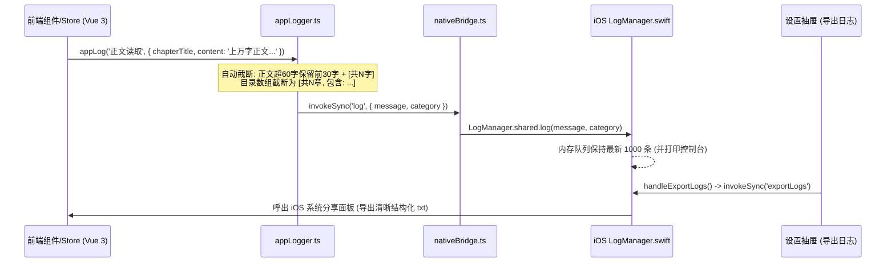

# Reader-Next App 离线功能测试问题深入剖析与修复方案

> **文档版本**：v1.1  
> **编写日期**：2026-09-09  
> **关联文档**：[《App端离线功能增强实施方案.md》](../App端离线功能增强实施方案.md)  
> **测试环境**：Reader-Next App v1.6.0 (iOS Hybrid WKWebView)

---

## 目录

- [一、 问题总览与现状分析](#一-问题总览与现状分析)
- [二、 问题 1：全本已离线再次点击仍重复下载](#二-问题-1全本已离线再次点击仍重复下载)
  - [2.1 现象重现](#21-现象重现)
  - [2.2 深度技术根因](#22-深度技术根因)
  - [2.3 修复方案与核心代码](#23-修复方案与核心代码)
- [三、 问题 2：飞行模式冷启动无法加载目录与内容](#三-问题-2飞行模式冷启动无法加载目录与内容)
  - [3.1 现象重现与阻断链条](#31-现象重现与阻断链条)
  - [3.2 深度技术根因](#32-深度技术根因)
  - [3.3 修复方案与核心代码](#33-修复方案与核心代码)
- [四、 问题 3：全本离线按钮背景色误导与技术文案优化](#四-问题-3全本离线按钮背景色误导与技术文案优化)
  - [4.1 视觉与交互问题剖析](#41-视觉与交互问题剖析)
  - [4.2 修复方案与样式调整](#42-修复方案与样式调整)
- [五、 App 运行日志模块增强（断网与离线排障调试系统）](#五-app-运行日志模块增强断网与离线排障调试系统)
  - [5.1 痛点分析与设计目标](#51-痛点分析与设计目标)
  - [5.2 整体架构与通信链路](#52-整体架构与通信链路)
  - [5.3 数据安全与防膨胀截断机制](#53-数据安全与防膨胀截断机制)
  - [5.4 关键生命周期与诊断埋点清单](#54-关键生命周期与诊断埋点清单)
  - [5.5 前后端核心实现代码](#55-前后端核心实现代码)
- [六、 改动文件清单与代码修改指引](#六-改动文件清单与代码修改指引)
- [七、 验证方案与测试矩阵](#七-验证方案与测试矩阵)

---

## 一、 问题总览与现状分析

在 1.6.0 版本的真机 App 测试中，发现了以下 3 个直接影响离线体验的核心缺陷，并提出了针对测试排障的日志增强需求：

| 序号 | 表现症状 / 需求项 | 影响严重度 | 核心技术原因与规划摘要 |
| :---: | :--- | :---: | :--- |
| **1** | 界面已显示“本机已离线 231 章节”（全本已缓存），再次点击“全本离线下载”，仍会从头重新下载一遍。 | 🟡 中度体验损耗 / 流量浪费 | `cacheBookToBrowser` 缺乏章节已缓存判重机制，无条件逐章发起 HTTP 网络请求；全本下载参数误传当前阅读索引，且未对全量就绪做前置拦截。 |
| **2** | 开启飞行模式后，杀死后台重新冷启动 App。书架正常展示，但打开该本已全本离线的书籍时，无法加载内容，没有读取到目录。 | 🔴 严重阻断 / 离线核心功能失效 | ① 离线下载时遗漏了目录落盘；② `loadBook` 中写入 IndexedDB 的目录对象包含 Vue 3 Proxy，在 WebKit 下抛出 `DataCloneError` 被吞；③ `withStore` 事务事件监听时序导致 Promise 挂死；④ 目录拉取失败后缺少从已离线正文逆向恢复目录的容灾兜底。 |
| **3** | “全本离线下载”按钮具有实心主色背景，在列表内误导用户以为当前已选定；离线提示出现 `IndexedDB` 技术词汇，普通用户无法理解。 | 🟢 界面视觉与交互规范 | 按钮误加了 `.primary` 实心主色类，视觉形同单选项的选中态；文案直接暴露底层技术名词 IndexedDB。 |
| **4** | **【新增】App 运行诊断日志增强**：方便在断网与离线测试中查看是否联网、是否读取本地书架、目录从何处读取、章节是否命中离线等，并截断正文防止日志膨胀。 | 🔵 诊断支撑 / 测试提效 | 建立贯穿前端 Vue 到 Native `LogManager` 的结构化日志通道，配备小说正文长文本自动截断、目录数组摘要化能力。 |

---

## 二、 问题 1：全本已离线再次点击仍重复下载

### 2.1 现象重现

用户在已缓存完整本书 231 章的状态下（摘要卡片已显示“本机已离线 231 离线可读章节”），再次点击【全本离线下载】。系统依然启动下载进度环，并从第 1 章开始逐章请求后端，耗费大量时间与带宽。

### 2.2 深度技术根因

经过对代码链路的深入审查，该问题由以下 **三个缺陷叠加造成**：

#### 缺陷 1：`bookCache.ts` 缺乏章节已缓存过滤与跳过机制（关键根因）
- **代码位置**：`frontend/src/utils/bookCache.ts:L31-51`
- **代码分析**：
  ```typescript
  for (const chapter of sliced) {
    if (params.signal?.cancelled) break
    // ❌ 无论本地是否已经缓存过该章，无条件调 getBookContent 发起 HTTP GET 请求！
    const content = await getBookContent({
      chapterUrl: chapter.url,
      bookSourceUrl: params.book.origin,
    })
    await setBrowserCachedChapter({
      bookUrl: params.book.bookUrl,
      chapterUrl: chapter.url,
      chapterTitle: chapter.title,
      content,
    })
    completed += 1
    ...
  }
  ```
  在 `browserCache.ts` 中明明已经封装了 `listBrowserCachedChapterUrls(bookUrl)` 函数，但在 `cacheBookToBrowser` 执行批量下载时，**从未调用该函数检查已缓存的章节集合**。即便本地 IndexedDB 已经完整存储了 231 章，循环依然对这 231 章发起 231 次网络请求重新覆盖写入。

#### 缺陷 2：`CacheManager.vue` 全本下载的 `startIndex` 计算逻辑错误
- **代码位置**：`frontend/src/components/reader/CacheManager.vue:L224-231`
- **代码分析**：
  ```typescript
  const total = count === 0
    ? Math.max(0, chapters.length - store.currentIndex) // ❌ 全本下载却用 currentIndex 计算！
    : Math.min(count, Math.max(0, chapters.length - store.currentIndex))
  await cacheBookToBrowser({
    book: store.book,
    chapters,
    startIndex: store.currentIndex, // ❌ 全本下载居然从 store.currentIndex 开始截取！
    count: count || undefined,
  ```
  “全本离线下载”（`count === 0`）的语义是**整本书（从第 0 章到最后一章）全量离线**。然而原逻辑传了 `startIndex: store.currentIndex`，如果用户读到第 50 章，前 49 章根本不在截取范围内；当用户在第 0 章点击时，则全量重复请求。

#### 缺陷 3：全量已缓存状态未进行前置拦截
如果整本书（或所选的后续章节）已经 100% 存在于本地离线存储中，无需进入耗时的循环流程，应当在校验后直接提示“当前章节已全部离线就绪”，瞬时反馈并完成。

### 2.3 修复方案与核心代码

#### 1. 改造 `bookCache.ts`：增量缓存与已离线秒级跳过
在执行章节下载循环前，先通过 `listBrowserCachedChapterUrls(book.bookUrl)` 取得本地已离线章节的 URL 集合。
若当前章节已在集合中，**直接计入 `completed` 并跳过网络请求**；若需要下载，则只针对未缓存章节发起请求。

```typescript
// frontend/src/utils/bookCache.ts
import { listBrowserCachedChapterUrls, setBrowserCachedChapter, setBrowserCachedChapterList } from './browserCache'

export async function cacheBookToBrowser(params: {
  book: Book
  chapters?: BookChapter[]
  startIndex?: number
  count?: number
  onProgress?: (progress: CacheProgress) => void
  signal?: { cancelled: boolean }
}) {
  const chapters = params.chapters || await resolveBookChapters(params.book)
  
  // 1. 优先将目录落盘到本地（彻底解决离线无目录问题）
  await setBrowserCachedChapterList(params.book.bookUrl, chapters, chapters.length).catch(() => undefined)

  // 全本离线（count === 0 或 undefined 且 startIndex 为 0）从 0 开始
  const startIndex = Math.max(0, params.startIndex || 0)
  const sliced = chapters.slice(startIndex, params.count ? startIndex + params.count : undefined)
  
  if (!sliced.length) {
    return { total: 0, completed: 0, newlyCached: 0 }
  }

  // 2. 读取本机已缓存的章节集合
  const cachedUrlSet = await listBrowserCachedChapterUrls(params.book.bookUrl).catch(() => new Set<string>())
  
  let completed = 0
  let newlyCached = 0

  for (const chapter of sliced) {
    if (params.signal?.cancelled) break

    // 已在本地离线：直接跳过网络请求，无需重复抓取
    if (cachedUrlSet.has(chapter.url)) {
      completed += 1
      params.onProgress?.({
        total: sliced.length,
        completed,
        chapterTitle: chapter.title,
      })
      continue
    }

    // 未在本地离线：网络拉取并写入
    const content = await getBookContent({
      chapterUrl: chapter.url,
      bookSourceUrl: params.book.origin,
    })
    await setBrowserCachedChapter({
      bookUrl: params.book.bookUrl,
      chapterUrl: chapter.url,
      chapterTitle: chapter.title,
      content,
    })
    cachedUrlSet.add(chapter.url)
    completed += 1
    newlyCached += 1

    params.onProgress?.({
      total: sliced.length,
      completed,
      chapterTitle: chapter.title,
    })
  }

  return {
    total: sliced.length,
    completed,
    newlyCached,
  }
}
```

#### 2. 修正 `CacheManager.vue` 的参数与提示
- 当 `count === 0`（全本离线下载）时，`startIndex` 固定为 `0`，`total` 为 `chapters.length`；
- 当 `count > 0`（后续 50/100 章）时，`startIndex` 为 `store.currentIndex`；
- 下载完成后，如果 `newlyCached === 0`，提示“本书已全部离线，无需重复下载”，否则提示“已下载 X 章到本机”。

---

## 三、 问题 2：飞行模式冷启动无法加载目录与内容

### 3.1 现象重现与阻断链条

1. 用户在联网状态下完成全本离线下载（界面显示已离线 231 章）；
2. 手机开启飞行模式（彻底断网）；
3. 杀死 App 进程后台，重新冷启动 App；
4. 首页书架正常加载（依赖 M2 的 `reader_bookshelf_cache` 本地持久化）；
5. 点击该离线书籍卡片进入阅读器：
   - 界面无法加载内容，呈现白屏/空白；
   - 点击侧边栏或目录按钮，**目录列表为空**；
   - 控制台或后台抛出未捕获的网络请求异常。

### 3.2 深度技术根因

这是一个涉及 **存储序列化、事务时序、调度时机与容灾回退** 的复合型问题，共有以下 4 层根因：

```mermaid
flowchart TD
    A[用户点击全本离线下载] -->|根因 1| B[只写了 chapters 正文表, 根本未调用目录持久化]
    C[用户平时在线看书 loadBook] -->|根因 2| D[chapters.value 为 Vue Proxy 数组]
    D -->|WebKit 序列化| E[Safari 抛出 DataCloneError]
    E -->|catch 空吞| F[目录从未真正写进 IndexedDB]
    G[飞行模式下打开书籍] --> H[getChapterList 网络失败]
    H --> I[读取 getBrowserCachedChapterList]
    I -->|根因 3| J[withStore 的 tx.oncomplete 时序 bug 导致 Promise 挂死]
    I -->|查无结果| K{本地是否有已缓存正文?}
    K -- 是 231 章都在 -->|根因 4| L[无逆向兜底, 直接 throw error 阻断进书]
```

#### 根因 1：全本离线下载调度中完全遗漏了目录落盘
查看 `bookCache.ts`，在整个批量缓存流程中，仅循环调用了 `setBrowserCachedChapter` 保存单章正文，**自始至终没有调用 `setBrowserCachedChapterList` 将书籍的完整目录存入 IndexedDB 的 `chapter_lists` 表**。导致用户如果只是点击了全本缓存，本地数据库中只有正文散列，没有书籍目录记录。

#### 根因 2：Vue 3 响应式 Proxy 导致 WebKit 结构化克隆崩溃（`DataCloneError`）
在 `reader.ts:L1763` 中，虽然有尝试落盘目录的代码：
```typescript
void setBrowserCachedChapterList(latestBook.bookUrl, chapters.value, chapters.value.length)
  .then(...)
  .catch(() => undefined)
```
但这里的 `chapters.value` 是被 Vue 3 响应式系统深度代理的 `Proxy` 对象数组。
在 iOS WKWebView（WebKit 内核）中，IndexedDB 的 `IDBObjectStore.put()` 采用底层的结构化克隆算法（Structured Clone Algorithm）。**WebKit 对 Proxy 对象的克隆有极为严格的限制，会直接抛出 `DataCloneError: The object could not be cloned`**！
由于外层使用了 `.catch(() => undefined)` 将异常静默吞掉，开发者完全无法察觉——**目录在 iOS 真机上根本从来没有成功写入过 IndexedDB**！

#### 根因 3：`browserCache.ts` 中 `withStore` 事务事件监听的时序竞争（Promise 挂死）
- **代码位置**：`frontend/src/utils/browserCache.ts:L78-101`
- **代码分析**：
  ```typescript
  async function withStore<T>(mode, handler, storeName) {
    const db = await openDb()
    return new Promise<T>((resolve, reject) => {
      const tx = db.transaction(storeName, mode)
      const store = tx.objectStore(storeName)

      handler(store)
        .then((result) => {
          // ❌ 致命时序缺陷：tx.oncomplete 挂在微任务回调之后！
          tx.oncomplete = () => resolve(result)
          tx.onerror = () => reject(tx.error)
        })
        .catch((error) => reject(error))
    })
  }
  ```
  在只读模式（`readonly`）下查询单条记录（如 `store.get(bookUrl)`），WebKit 引擎执行查询速度极快。当 `handler(store)` 中的 `get` 操作结束、微任务队列轮转到 `.then` 时，底层的只读事务 **可能早已自动触发完成（complete）并结束了**！
  此时再去向一个已经处于 `finished` 状态的事务绑定 `tx.oncomplete`，该事件**永远不会再次触发**，导致整个 `Promise` 永久处于 `pending` 挂死状态，应用直接卡死在目录读取上！

#### 根因 4：缺乏从已离线正文反向恢复目录的第二级容灾机制
在 `reader.ts` 中：
```typescript
try {
  chapters.value = await getChapterList(...)
} catch (error) {
  const cached = await getBrowserCachedChapterList(latestBook.bookUrl)
  if (cached && cached.chapters.length > 0) {
    chapters.value = cached.chapters
  } else {
    loading.value = false
    throw error // ❌ 只要 chapter_lists 为空直接抛错阻断！
  }
}
```
即便 `chapter_lists` 出现损坏或老数据缺失，用户的 IndexedDB 中明明已经有该书全部 231 章正文记录（包含 `chapterTitle` 与 `chapterUrl`）。但代码完全没有尝试从已离线正文表中反向构建应急目录，直接抛出未捕获异常，导致 `HomeView.vue` 中后续的 `loadChapter` 无法执行，阅读器呈现全白屏。

### 3.3 修复方案与核心代码

#### 1. 修复 `withStore` 事务时序，立即挂载监听器
```typescript
// frontend/src/utils/browserCache.ts
async function withStore<T>(
  mode: IDBTransactionMode,
  handler: (store: IDBObjectStore) => Promise<T>,
  storeName: string = STORE_NAME,
): Promise<T> {
  const db = await openDb()
  return new Promise<T>((resolve, reject) => {
    const tx = db.transaction(storeName, mode)
    const store = tx.objectStore(storeName)
    let result: T

    // 立即挂载事务事件，防止微任务时差导致错过 oncomplete
    tx.oncomplete = () => {
      resolve(result)
    }
    tx.onerror = () => {
      reject(tx.error)
    }
    tx.onabort = () => {
      reject(tx.error || new Error('Transaction aborted'))
    }

    handler(store)
      .then((res) => {
        result = res
      })
      .catch((error) => {
        reject(error)
      })
  })
}
```

#### 2. 纯 Plain Object 脱敏落盘目录，规避 `DataCloneError`
在 `setBrowserCachedChapterList` 写入 IndexedDB 前，执行深度纯 JSON 序列化，清除 Vue 3 Proxy 拦截器：
```typescript
// frontend/src/utils/browserCache.ts
export async function setBrowserCachedChapterList(bookUrl: string, chapters: BookChapter[], totalChapterNum: number) {
  if (!bookUrl || !chapters?.length) return
  // 深度脱敏：将 Vue Proxy 转换为纯原生 JS 字典，防止 WebKit 报 DataCloneError
  const plainChapters: BookChapter[] = JSON.parse(JSON.stringify(chapters))

  return withStore('readwrite', async (store) => {
    const record: BrowserChapterListRecord = {
      bookUrl,
      chapters: plainChapters,
      totalChapterNum,
      updatedAt: Date.now(),
    }
    await requestToPromise(store.put(record))
  }, CHAPTER_LIST_STORE)
}
```

#### 3. 增设“从已离线正文提取目录”第二级容灾兜底
在 `browserCache.ts` 中新增 `restoreChapterListFromCacheRecords` 工具函数：
```typescript
// frontend/src/utils/browserCache.ts
export async function restoreChapterListFromCacheRecords(bookUrl: string): Promise<BookChapter[]> {
  try {
    return await withStore('readonly', async (store) => {
      const index = store.index('bookUrl')
      const records = (await requestToPromise(index.getAll(IDBKeyRange.only(bookUrl)))) as BrowserChapterCacheRecord[]
      if (!records || !records.length) return []
      
      // 根据存储记录重组章节目录
      return records.map((r, i) => ({
        index: i,
        title: r.chapterTitle || `第 ${i + 1} 章`,
        url: r.chapterUrl,
      }))
    }, STORE_NAME)
  } catch {
    return []
  }
}
```

#### 4. 在 `reader.ts` 的 `loadBook` 中打通双级容灾寻址
```typescript
// frontend/src/stores/reader.ts
try {
  chapters.value = await getChapterList({
    bookUrl: latestBook.bookUrl,
    bookSourceUrl: latestBook.origin,
  })
  // 远端成功：立即落盘纯净目录
  void setBrowserCachedChapterList(latestBook.bookUrl, chapters.value, chapters.value.length)
    .then(() => cleanupOrphanChapters(latestBook.bookUrl, new Set(chapters.value.map((c) => c.url).filter(Boolean))))
    .catch((e) => console.warn('目录落盘异常', e))
} catch (error) {
  // 远端失败：第一级从 chapter_lists 读取
  const cached = await getBrowserCachedChapterList(latestBook.bookUrl)
  if (cached && cached.chapters.length > 0) {
    chapters.value = cached.chapters
    appStore.showToast('已切换离线目录', 'warning')
  } else {
    // 第二级容灾：从已离线章节正文记录恢复应急目录
    const fallbackChapters = await restoreChapterListFromCacheRecords(latestBook.bookUrl)
    if (fallbackChapters.length > 0) {
      chapters.value = fallbackChapters
      appStore.showToast('已根据本地已缓存章节恢复目录', 'warning')
    } else {
      loading.value = false
      throw new Error('离线状态且本地无目录缓存，请联网后重试')
    }
  }
}
```

---

## 四、 问题 3：全本离线按钮背景色误导与技术文案优化

### 4.1 视觉与交互问题剖析

1. **按钮背景色**：
   在 `CacheManager.vue` 中，全本离线下载按钮使用了 `.cache-opt.primary`。
   在 CSS 中其样式为：
   ```css
   .cache-opt.primary {
     background: var(--color-primary, #c97f3a);
     border-color: var(--color-primary, #c97f3a);
     color: white;
   }
   ```
   在一组下载动作选项中，上面的“下载后续 50 章”、“下载后续 100 章”均为透明底/白底，仅有“全本离线下载”呈现为高饱和度实心底色。这在移动端设计规范中与“已选中的单选项”高度雷同，极易让用户误以为该项已经被选中。
2. **底层技术词汇暴露**：
   - 提示卡片：“`下载到本机后，断网仍可流畅阅读。本机离线数据保存在当前设备 IndexedDB，可随时清除。`”
   - 按钮副标题：“`持久化到本机 IndexedDB`”
   `IndexedDB` 属于底层技术 API 术语，普通小说读者完全不知道是什么，会产生疑虑与困惑。

### 4.2 修复方案与样式调整

#### 1. 移除按钮实心背景色
移除 `.primary` 类，使全本离线按钮与其他按钮保持统一的操作按钮形态（透明底、统一边框色和悬停样式）。
```html
<!-- 移除 primary 类，与上方选项保持一致 -->
<button class="cache-opt" @click="startBrowserCaching(0)">
  <span class="label">全本离线下载</span>
  <span class="sub">离线整本书籍到本地</span>
</button>
```

#### 2. 文案通俗化改造
- 将提示卡片文案修改为：  
  `下载到本机后，断网仍可流畅阅读。本机离线数据保存在当前设备，可随时清除。`
- 将按钮副标题文案修改为：  
  `离线整本书籍到本地`（明确表达功能含义，隐去持久化与 IndexedDB 词汇）。

---

## 五、 App 运行日志模块增强（断网与离线排障调试系统）

### 5.1 痛点分析与设计目标

在测试飞行模式、弱网以及离线缓存链路时，测试人员与开发者面临以下痛点：
1. **黑盒排障难**：手机断网后，无法直观知道 App 此时是在尝试连接后端还是已经自动降级为离线模式，无法确认目录是从后端拉取、从 `chapter_lists` 读取，还是触发了正文容灾反推；
2. **缺乏前端生命周期日志**：当前 iOS 原生端已具备 `LogManager.swift`，但前端（Vue 3）的核心动作（书架读取、目录查询、章节缓存命中/网络请求、离线批处理进度）从未上报给日志系统；
3. **日志膨胀风险（关键约束）**：一部小说动辄上百万字、单章几千字、目录上千条。如果直接向日志中输出小说正文或完整目录数组，会瞬间撑爆日志缓冲区（`maxLogs` 溢出）并导致导出文件体积过大，且包含大量无用的文本噪音。

**设计目标**：
- 在前端建立全局统一的轻量级日志工具 `appLog`；
- 将前端关键运行状态（网络、书架、目录、正文、缓存调度）打通桥接到 iOS 原生 `LogManager`；
- **严格实施智能安全截断**：长文本正文、大数组、Token 自动脱敏与摘要化；
- 无缝对接现有的【设置 $\rightarrow$ 导出 App 日志】菜单，一键分享完整调试证据链。

### 5.2 整体架构与通信链路



### 5.3 数据安全与防膨胀截断机制

针对小说 App 场景定制以下截断过滤规则：

1. **小说长正文截断规则**：  
   对任何标记为正文内容（`content`、`text`、`chapterContent`）的字符串，若长度超过 60 个字符，仅保留前 30 个字符，格式化为：  
   `"床前明月光，疑是地上霜... [正文共 3520 字]"`；
2. **目录与章节数组摘要化规则**：  
   对包含成百上千项的章节列表（`chapters`、`chapterList`），禁止 dump 全量 JSON。转换为紧凑元数据：  
   `"{ 章节总数: 231, 前3章: ['第1章 序幕', '第2章 风起', '第3章 惊变'], 末章: '第231章 终章' }"`；
3. **书架书籍列表摘要化**：  
   只记录书籍总本数与书名列表摘要（如 `[江山如此多娇, 诡秘之主...] 共 12 本`），去除每本书庞大的描述、历史配置等；
4. **敏感字段过滤**：  
   自动将 `accessToken`、`password` 等替换为 `******` 或保留前 6 位，避免在导出日志时泄露凭证。

### 5.4 关键生命周期与诊断埋点清单

| 模块分类 | 触发时机 | 输出日志示例 |
| :---: | :--- | :--- |
| **网络状态感知** | 启动探测 / 飞行模式切换 / `online`/`offline` 事件 | `[网络] 状态变更: 当前处于【离线模式】(断网/飞行模式)`<br>`[网络] 状态变更: 检测到【网络恢复在线】` |
| **书架读取流程** | App 启动 / 首页加载 / 下拉刷新 | `[书架] 优先加载本地离线书架成功, 共 8 本书`<br>`[书架] 尝试静默同步远端书架...`<br>`[书架] 远端书架同步失败: Network Error, 保持本地离线书架展示` |
| **目录寻址流程** | 点击书籍进入阅读器 / `loadBook` | `[目录] 开始加载书籍目录: 《江山如此多娇》(bookUrl=...)`<br>`[目录] 远端 getChapterList 失败: 离线模式, 尝试读取本地目录`<br>`[目录] ✅ 成功从本地 chapter_lists 读取离线目录, 共 231 章`<br>`[目录] ⚠️ 本地目录表为空, 触发第二级容灾: 成功从已离线正文表恢复 231 章目录` |
| **章节正文寻址** | 翻页 / 点击目录切章 / `fetchChapterContent` | `[正文] 读取第 10 章《深入腹地》: ✅ 命中本机离线缓存 (size: 4.2KB)`<br>`[正文] 读取第 11 章: 本地无缓存, 当前在线, 发起远端网络请求`<br>`[正文] 读取第 12 章: ❌ 当前离线且本地未缓存, 阻断并提示用户` |
| **离线下载调度** | 缓存面板点击“下载后续/全本” | `[缓存] 触发全本离线下载: 本书共 231 章, 本地已离线 231 章, 需下载 0 章`<br>`[缓存] ✅ 本书已全量离线, 秒级跳过无需重复请求`<br>`[缓存] 下载进度: (120/231) 当前下载: 《第120章》, 耗时 42ms` |

### 5.5 前后端核心实现代码

#### 1. 前端轻量截断与上报模块：`frontend/src/utils/appLogger.ts`
```typescript
// frontend/src/utils/appLogger.ts
import { invokeSync, isNativeApp } from './nativeBridge'

/** 智能截断与脱敏，防止日志体积过度膨胀 */
function sanitizeDetails(details: any): any {
  if (details == null) return ''
  if (typeof details === 'string') {
    return details.length > 60 ? `${details.slice(0, 30)}... [共 ${details.length} 字]` : details
  }
  if (Array.isArray(details)) {
    if (details.length > 5) {
      const head = details.slice(0, 3).map((item) => (typeof item === 'object' ? (item.title || item.name || item.url) : item))
      return `[数组共 ${details.length} 项, 前3项: ${JSON.stringify(head)}]`
    }
    return details.map(sanitizeDetails)
  }
  if (typeof details === 'object') {
    const clean: Record<string, any> = {}
    for (const [k, v] of Object.entries(details)) {
      if (k === 'content' || k === 'text' || k === 'chapterContent') {
        const textStr = String(v || '')
        clean[k] = textStr.length > 60 ? `${textStr.slice(0, 30)}... [正文共 ${textStr.length} 字]` : textStr
      } else if (k === 'chapters' && Array.isArray(v)) {
        clean[k] = `[章节列表共 ${v.length} 章]`
      } else if (k === 'accessToken' || k === 'password') {
        clean[k] = '******'
      } else {
        clean[k] = sanitizeDetails(v)
      }
    }
    return clean
  }
  return details
}

/**
 * 记录 App 运行诊断日志
 * @param category 分类标签，如 '网络' | '书架' | '目录' | '正文' | '缓存'
 * @param message 简明描述
 * @param details 附加详细信息（自动截断）
 */
export function appLog(category: string, message: string, details?: any) {
  let logText = message
  if (details !== undefined) {
    try {
      const sanitized = sanitizeDetails(details)
      const detailStr = typeof sanitized === 'string' ? sanitized : JSON.stringify(sanitized)
      logText = `${message} | ${detailStr}`
    } catch {
      logText = `${message} | [附加信息解析失败]`
    }
  }

  // 1. 控制台输出（开发环境/浏览器）
  console.log(`[${category}] ${logText}`)

  // 2. 原生 App 桥接输出（录入 iOS LogManager 统一导出）
  if (isNativeApp()) {
    try {
      invokeSync('log', { category, message: logText })
    } catch {
      // 忽略原生通讯降级
    }
  }
}
```

#### 2. iOS 原生端响应 `log` 指令：`ios/ReadApp/ContentView.swift`
在 `handleSyncControl` 中增加对 `log` action 的响应：
```swift
// ios/ReadApp/ContentView.swift -> handleSyncControl
private func handleSyncControl(action: String, payload: [String: Any]?) {
    if action == "log" {
        let category = (payload?["category"] as? String) ?? "前端"
        let msg = (payload?["message"] as? String) ?? ""
        LogManager.shared.log(msg, category: category)
        return
    }
    // 其余 saveProgress, exportLogs 逻辑保持不变...
}
```

#### 3. 关键业务埋点注入示意
- **在 `bookshelf.ts` 中记录书架读取**：
  ```typescript
  appLog('书架', `从本地缓存读取书架成功，共 ${books.value.length} 本书`)
  ```
- **在 `reader.ts` 中记录目录寻址**：
  ```typescript
  appLog('目录', `远端目录获取失败，从本地 chapter_lists 读取离线目录成功 (${cached.chapters.length} 章)`)
  appLog('目录', `触发第二级正文容灾反推，成功还原目录 (${fallbackChapters.length} 章)`)
  ```
- **在 `reader.ts` 中记录正文缓存命中**：
  ```typescript
  appLog('正文', `第 ${index} 章《${chapter.title}》读取完成`, { hitOffline: !!browserCached })
  ```
- **在 `bookCache.ts` 中记录离线下载过滤**：
  ```typescript
  appLog('缓存', `批量离线调度: 共 ${sliced.length} 章, 已跳过已缓存 ${completed} 章, 实际下载 ${newlyCached} 章`)
  ```

---

## 六、 改动文件清单与代码修改指引

| 序号 | 文件路径 | 涉及改动点 |
| :---: | :--- | :--- |
| **1** | [`frontend/src/utils/appLogger.ts`](../frontend/src/utils/appLogger.ts) | **【新增】** App 结构化日志工具：包含小说长正文截断、大数组摘要化、脱敏与 Native 桥接上报。 |
| **2** | [`ios/ReadApp/ContentView.swift`](../ios/ReadApp/ContentView.swift) | `handleSyncControl` 接收 `action == "log"` 指令并录入原生 `LogManager`。 |
| **3** | [`frontend/src/utils/browserCache.ts`](../frontend/src/utils/browserCache.ts) | ① `withStore` 立即绑定 `tx.oncomplete` / `tx.onerror` / `tx.onabort`；<br>② `setBrowserCachedChapterList` 执行 `JSON.parse(JSON.stringify)` 脱敏防止 WebKit `DataCloneError`；<br>③ 新增 `restoreChapterListFromCacheRecords` 实现从正文反推目录兜底。 |
| **4** | [`frontend/src/utils/bookCache.ts`](../frontend/src/utils/bookCache.ts) | ① 批量缓存开始前，强制先写入目录缓存；<br>② 下载循环前通过 `listBrowserCachedChapterUrls` 查重，跳过已离线章节，杜绝全本重复请求；<br>③ 增加 `appLog` 记录离线缓存调度全过程。 |
| **5** | [`frontend/src/components/reader/CacheManager.vue`](../frontend/src/components/reader/CacheManager.vue) | ① 移除全本离线按钮的 `.primary` 类，消除误导性实心背景；<br>② 文案剔除 `IndexedDB`，修改为通俗的“当前设备”与“离线整本书籍到本地”；<br>③ 修复全本离线时 `startIndex: 0` 的传参错误；<br>④ 增加已全本离线时的快捷拦截提示。 |
| **6** | [`frontend/src/stores/reader.ts`](../frontend/src/stores/reader.ts) | ① `loadBook` 中增加第二级容灾兜底（`restoreChapterListFromCacheRecords`）；<br>② 注入网络、目录读取、正文缓存命中关键埋点日志。 |
| **7** | [`frontend/src/stores/bookshelf.ts`](../frontend/src/stores/bookshelf.ts) | 注入书架冷启动本地出箱、远端拉取状态的埋点日志。 |

---

## 七、 验证方案与测试矩阵

在修复完成后，需按照以下测试矩阵在真机或模拟器上执行断网回归验收：

| 用例编号 | 测试场景 | 测试步骤 | 预期结果 |
| :---: | :--- | :--- | :--- |
| **TC-01** | 全本重复下载校验 | 书籍已全量离线 231 章，在缓存管理再次点击【全本离线下载】。 | 不发起任何章节的正文网络请求，秒级完成并提示“本书已全部离线，无需重复下载”；日志记录 `已跳过已缓存 231 章`。 |
| **TC-02** | 增量离线下载校验 | 书籍已离线前 100 章，在第 50 章点击【下载后续 100 章】。 | 前 50 章秒级跳过，仅对后 50 章未下载内容发起网络请求。 |
| **TC-03** | 飞行模式冷启动进书 | ① 联网全本离线一本书；<br>② 开启飞行模式断网；<br>③ 杀死 App 杀后台；<br>④ 重新冷启动 App，从书架点击该书。 | ① 目录秒级呈现，不提示网络报错；<br>② 正文第一页秒级排版展示；<br>③ 目录抽屉可正常展开并点击任意章节跳转阅读；<br>④ 导出日志中清晰记录 `从本地 chapter_lists 读取离线目录成功`。 |
| **TC-04** | 目录异常容灾兜底 | 模拟 `chapter_lists` 表无数据但 `chapters` 表已有 231 章离线正文，断网进入书籍。 | 系统自动通过正文记录还原应急目录，不白屏、不抛阻断异常，书籍正常可读；日志清晰记录 `触发第二级正文容灾反推`。 |
| **TC-05** | UI 样式与提示词规范 | 检查缓存管理面板所有视觉与文本。 | ① 全本离线下载按钮为常规透明底边框，无选中误导；<br>② 面板所有文案均无 `IndexedDB` 字样。 |
| **TC-06** | 日志导出与防膨胀验证 | 在阅读过程中进行多次翻页、离线下载，随后点击【设置 $\rightarrow$ 导出 App 日志】。 | ① 日志文件顺利导出；<br>② 日志包含网络、书架、目录、正文加载的清晰链路；<br>③ 正文文本被截断为 `...[正文共 X 字]`，目录被压缩为 `[共 X 章]`，日志文件体积精简适度（通常在数十 KB 内）。 |
